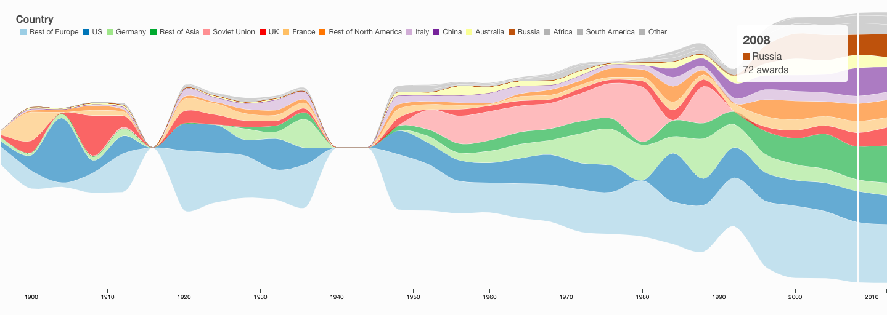

# 120 Years of Olympics History
**Authors**: Ayush Sethi (as11500), Vaibhav Lodha (vl1015), Vishwali Mhasawade (vvm248@)

Group 9 

## About
Keeping in sight the history of Olympics, we are trying to tell the history of our world in the last century. We have
picked up select moments of the last century which had their impact on entire world and can also be seen through
the Olympics.

## More
[DEMO](https://nyu-vis-fall2018.github.io/project-template/)

[Project Descrioption](Group9_Storyboarding.pdf)
